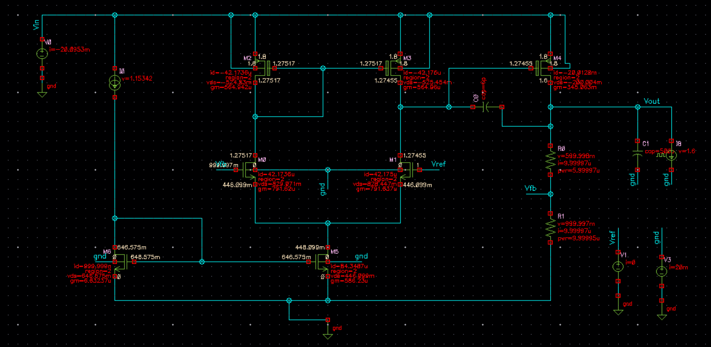

# Low-Drop-out-Voltage-Regulator-
This project is a design and analysis of a Low Dropout Voltage Regulator (LDO) intended for efficient power management in embedded systems.
## Specifications
- Input Voltage (Vin): 1.8V
- Output Voltage (Vout): 1.6V
- Load (output) Current (Iload): 50 mA (Nominal), 20 mA (light-load), 100 mA (full-load)
- Cout(OFF-CHIP) = 500 pF
- Cm (ON-CHIP) ≤ 6 pF
- PSRR@100KHz(dB): -36.21dB
- η(Efficiency) ≥ 88.46% (across load range)
- DC Error in Vout : ≤ ±0.1 mV 
- Load Regulation ≤ 0.05% variation from light-load to full-load
- Line Regulation ≤ 0.00125% for ±2.5% variation in input voltage
- Transient Response: ≤ 150mV overshoot/undershoot for a 20mA to 50mA load step (both up and down with
   edge time of 10ns) with settling time (output voltage within ±2% of the regulated value) less than 125 ns.
- Features: Overcurrent protection, low noise, fast transient response

## Features
- High efficiency at low dropout
- Integrated protection circuits
- Suitable for battery-powered devices

## Project Overview
The LDO is designed for use in portable electronics where low noise and high efficiency are critical.

## (Optional) Block Diagram

## Usage
See the attached report for detailed design, simulation results, and testing methodology.

## License
MIT License

## Credits
Designed by [Your Name]
